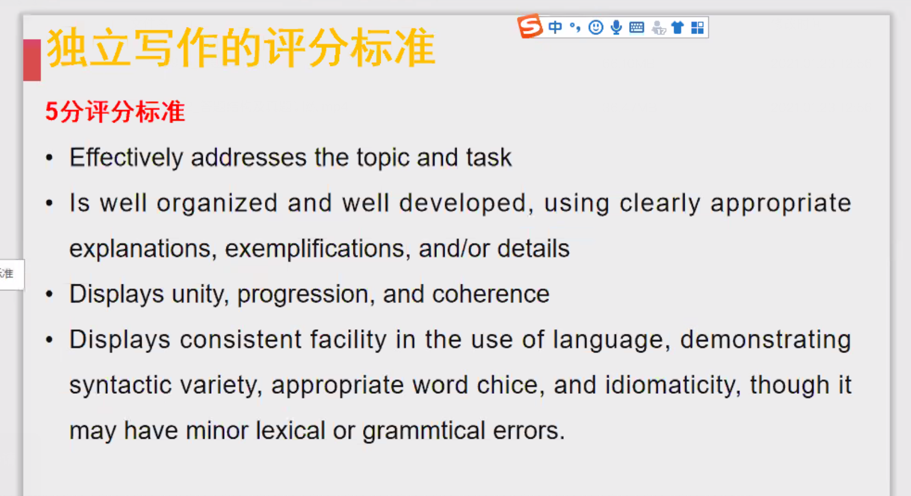
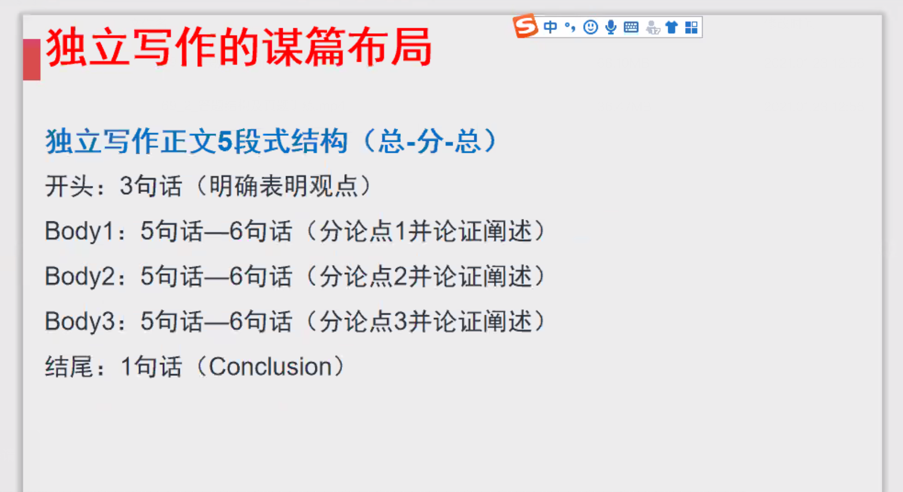
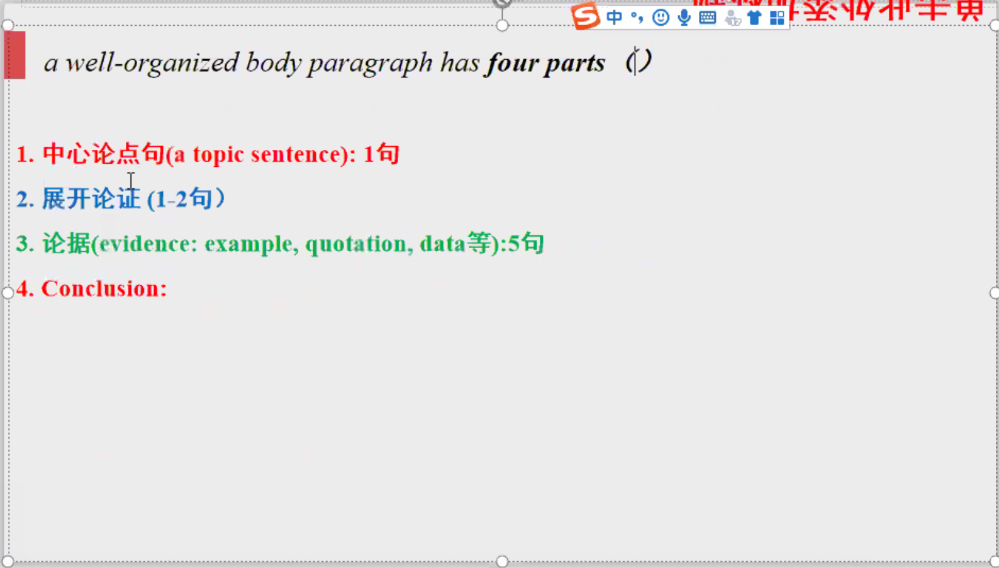
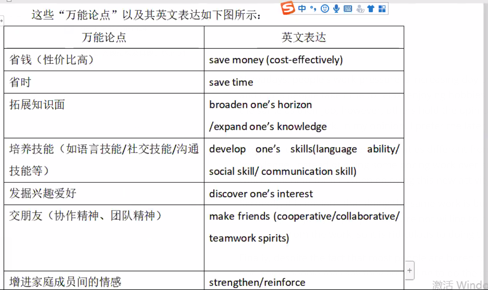
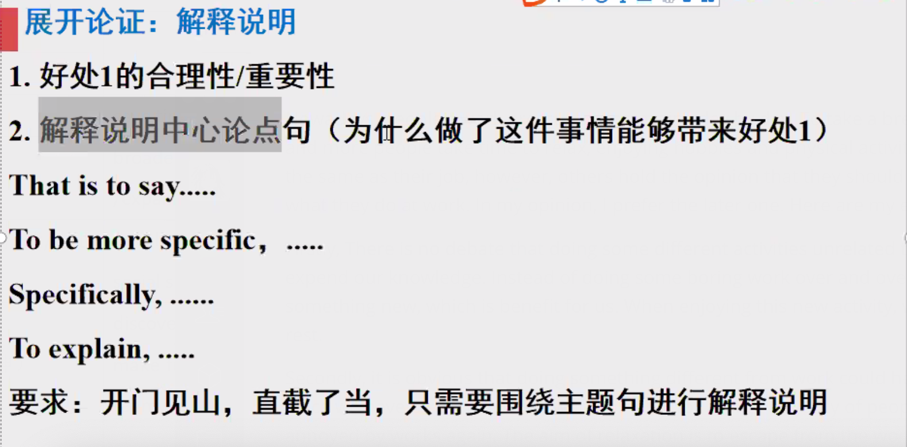
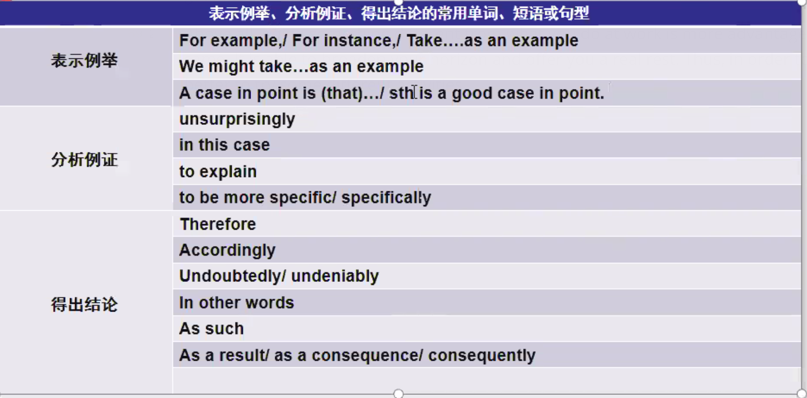

# 课堂笔记

## Lec1

### 评分标准

1.

审题

立论：准确性（切题，包含题目中所有关键词，包含所有逻辑关系）

2.

结构清晰（总分总），**用例子细节支撑**。论据是否充足，例子是否翔实，是高分关键。

3.

文章行文逻辑，前后对应。内容，句子间要有逻辑关系。

**逻辑关系词使用正确 文章前后内容相互对应**

4.

语言（语法正确/语言多样性**语法词汇**）

### 独立写作结构

四段前提是Body1.2有充足的内容（详细展开）

#### Body1.2结构（抽象到具体）:

##### 1.中心论点句 1

内容：

是最终结果 

每个论点之间不能重复或者相互包含 

每个段落的中心论点只能一个

论点一定要具体（不要抽象或过于主观）

语言：

简洁（不要用多重从句）而不简单（不要用非常简单的句子）

句型：

It becomes rather apparent that...

We might easily find that...

There are good reasons to suggest that...

There is much evidence that...

There is no debate/denying/doubt that...

We need to eliminate the stereotype that...

It is conceivable/imperative that...

It is significantly important to point out that...

万能理由：

...

2.展开论证 1-2（解释说明中心论点，为什么这样能带来好处）(两句的情况：好处1的合理性和重要性，在那种比较不直接的论点使用)

That is to say...

To be more specific...

Specifically...

To explain...

##### 3.论据 5（3）

举例子

##### 4.总结 1

broaden horizon

open one's eyes

expend one's knowledge