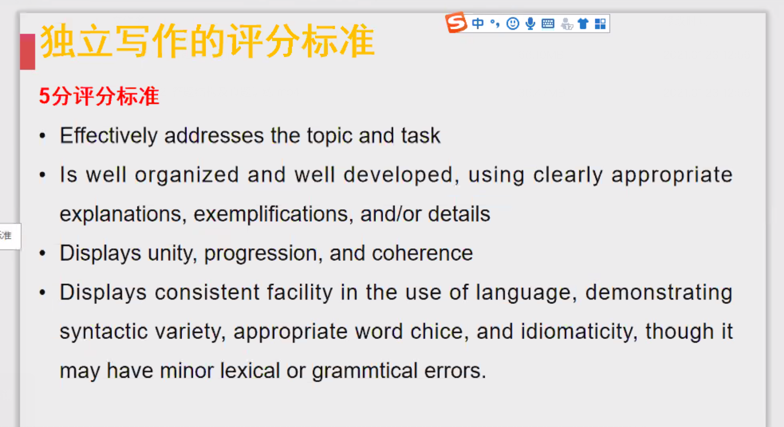
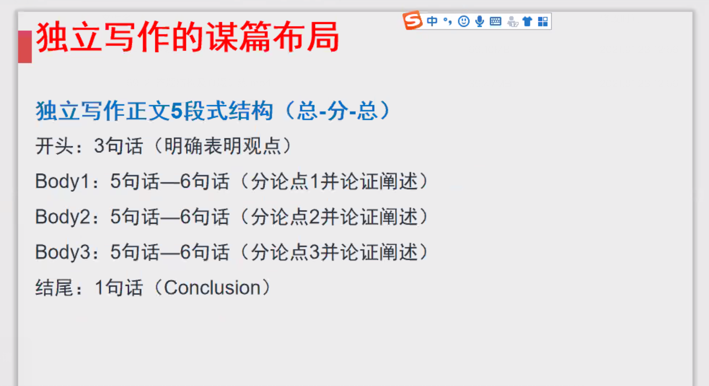
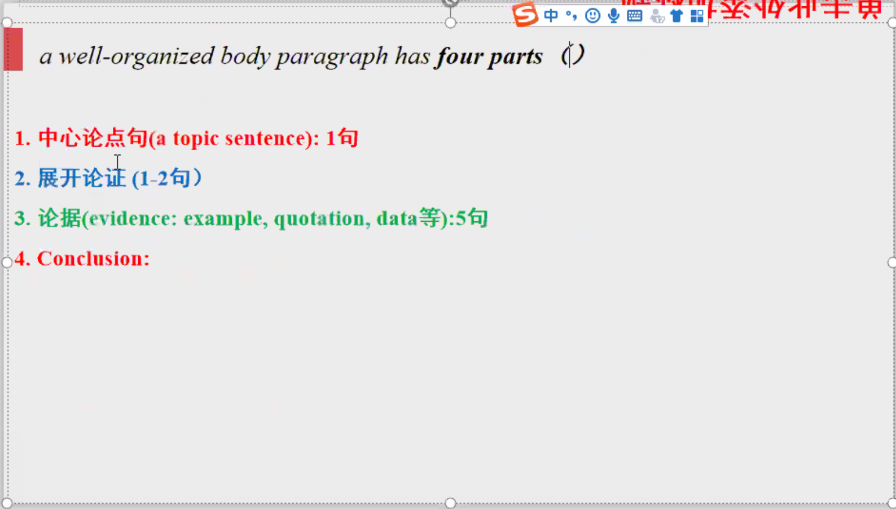
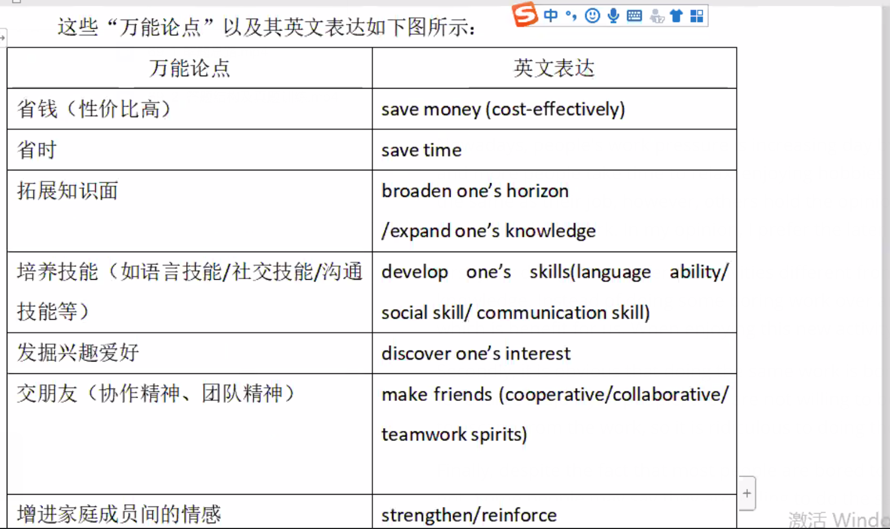
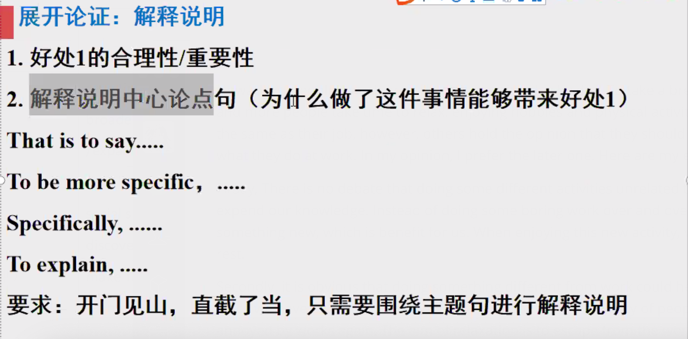
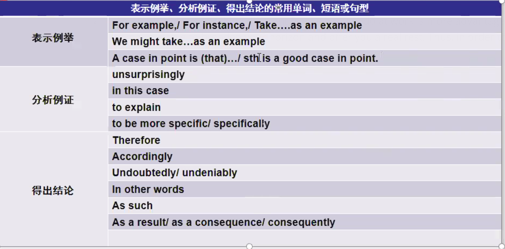

# 课堂笔记

## 独立写作

### 评分标准

1. 审题立论：准确性（切题，包含题目中所有关键词，包含所有逻辑关系）

2. 结构清晰（总分总），**用例子细节支撑**。论据是否充足，例子是否翔实，是高分关键。

3. 文章行文逻辑，前后对应。内容，句子间要有逻辑关系。

   **逻辑关系词使用正确 文章前后内容相互对应**

4. 语言（语法正确/语言多样性**语法词汇**）

### 独立写作结构

四段前提是Body1.2有充足的内容（详细展开）

#### 开头段

三个部分三句话

1.第一句 **背景介绍**

2.第二句 **引出题目(别人的观点)**

Many people, if not most, are strong believers in the statement that... 

3.第三句 **表明观点**

from my stand point/ point of view

as far as I am concerned 

...

后接 with the following reasons

#### Body1.2结构（抽象到具体）:

##### 1.中心论点句（1句）

**内容：**

是最终结果 

每个论点之间不能重复或者相互包含 

每个段落的中心论点只能一个

论点一定要具体（不要抽象或过于主观）

**语言：**

简洁（不要用多重从句）而不简单（不要用非常简单的句子）

**句型：**

It becomes rather apparent that...

We might easily find that...

There are good reasons to suggest that...

There is much evidence that...

There is no debate/denying/doubt that...

We need to eliminate the stereotype that...

It is conceivable/imperative that...

It is significantly important to point out that...

**万能理由：**

...

##### 2.展开论证 （1-2句）（解释说明中心论点，为什么这样能带来好处）(两句的情况：好处1的合理性和重要性，在那种比较不直接的论点使用)

That is to say...

To be more specific...

Specifically...

To explain...

##### 3.论据（3-5句）

##### 4.总结（1句）

见上图

#### 让步转折段结构（可选）：

##### 1.让步：我方的让步和对方的让步

我方的让步：写一个我方的缺点/问题

我方的让步：写一个我方的缺点/问题

Ex:

**1）Admittedly, some people may argue that 一个我方的缺点/一个对方的优点**

**2）论证展开**

与第一段第二段论证展开写法一致

1 我方缺点/对方的优点的合理性/重要性（根据题目具体需求选择写或不写）

2 解释说明“我方为什么我这个缺点？”/“对方为什么有这个优点？” （必写）

##### 2.转折

目的：对让步部分进行强有力的削弱。

**1）虽然我方有一个缺点/问题，但可以得到改正/解决，或者已经改正/解决**

Ex: However, they ignore the fact that there are a lot of approaches to solve this problem/the problem has been solved with the following ways. First, 第一个sol. Second, 第二个sol.

**2）虽然反方有一个优点1，但这个优点1我方也有。不仅如此，我方在没有反方缺点的前提下还有优点2+优点3...**

Ex: However, they ignore the fact thar 我方 also have/can + 反方优点1 without adverse effect/impact on... In addition/Additionally, 我方优点2... 我方优点3.

**3）虽然反方有优点2，但是反方也有缺点1+2，缺点>优点，所以不能选。**

Ex: However, I have to point out that 反方的 disadvantages outweigh its advantage. On the one hand, 第一个缺点.On the other hand, 第二个缺点。

##### 3.总结(重申自己的观点)

Therefore/Thus/As a result/Consequently... ，我方的观点成立。

#### 结尾段

in conclusion 

to sum up

**三部分**

1.明确的观点（换种表达）

2.支撑观点的分论点（body的中心论点句）

3.让步部分

**我的观点 with respect to 分论点**

broaden horizon

open one's eyes

expend one's knowledge

get rid of

never fail to

play a pivotal role in ...

