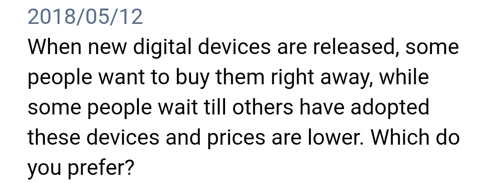
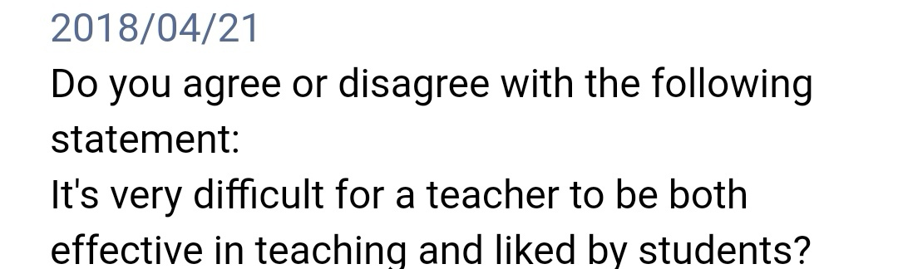

# Q1:

------

Nowadays, the popularity of digital devices is getting higher and higher and the updates of the products are quite fast compared to the past few years. Many people, if not most, are strong believers in the statement that when new electronic products released, we should buy them right away. However, from my standpoint, I prefer to waiting with the following reasons.

First and foremost, there is much evidence that waiting till others have adopted these devices can offer you a better user experience. To be more specific, when a product is first released, it has not been tested enough. Thus, it is always along with many bugs. The engineers sometimes need a couple of months to get everything fixed. We might take iPhone as an example, when iPhone 8 was released, the buyer found that the signal of the new product is awful, and this problem took Apple's engineers two months to fix. However, people who bought the product late got a good user experience since most bugs had been fixed. Accordingly, we can get better user experience if we buy the product later.

Secondly, it is significantly important to point out that waiting can also save money. That is to say, most of the time, the price of a new product is high, but in the near future, the price will drop significantly. At this time, the purchase is very affordable. For example, if you want to buy the latest Xiao MI, it will cost you more than 5000RMB, a large number of money for normal families. However, after two months or so, the price will drop 500RMB, sometimes even 1000RMB. Therefore, buying digital products later truly save your money.

Admittedly, some people may argue that buying digital devices late is not worthwhile since next generation is about to be released. That is to say, although you save money, you buy a obsolete product. However, they ignore the fact that there are a lot of approaches to solve this problem. However, they ignore the fact that some product update is not so obvious, so it is not worth for you to pay extra money to experience. Therefore, avoiding buying digital products right away is a wise decision.

In conclusion, avoiding buying digital products right away is beneficial with respect to convenience and saving money. 

# Q2:

------

In the past two decades, more and more children have the opportunity to be educated. Many people, if not most, are strong believers in the statement that it is difficult for a teacher to be both effective in teaching and liked by student. However, as far as I am concerned, it is not that hard with the following reasons.

Firstly, we might easily find that an effective teacher usually has a higher level of teaching method so that he could help students learn knowledge fast, in other words, saving children's time. That is to say, children could have more spare time to do what they really want to do, which could undoubtedly gain popularity among students. For example, when I was in middle school, our physics teacher Andrew was an effective teacher. In class, he always used some visual models and diagrams to help students understand new knowledge. In order to help us understand the physical phenomena in the textbook, he always took us to the school laboratory to experience it by ourselves. Through these methods, students could understand new concepts more quickly, and the efficiency of class was greatly improved, that was why his class never procrastinated. So students could use the time after class to take a good rest or do what they want. Thus, he was popular in our class. Therefore, a teacher who can help students to get high score can get students' admiration.

Secondly, there are good reasons to suggest that a teacher who is welcomed by students is effective in teaching. To be more specific, in most instances,  a popular teacher is easier to capture students' attention so that he could teach students more. We might take my teacher John, who is humorous, as an example. In his class, he always tells some jokes to liven up the atmosphere. Compared to other teachers, in his class, very few students chat with others or sleep. The knowledge he told is more novel and vivid. Students are willing to listen to his class, that is why his class is often overcrowded. He is quite popular among us. There is no doubt that his class results are also the best. Undeniably, it shows that a teacher who is welcomed by students is effective.

Admittedly, some people may argue that teacher can not be both effective in teaching and liked by student. Since most students feel disgusted with excessive learning pressure, a teacher assigns too much homework  will definitely not be welcomed by students. However, they ignore the fact that there are a lot of approaches to solve this problem. First, telling students that teacher assigning so many homework is a manifestation of responsibility so that students can understand the teacher’s behavior. Second, despite of the great study pressure, teachers can reward outstanding students to encourage them so that they will not feel ddistressed to finish their academic burden. Therefore, being both effective and welcomed is not hard for teachers.

To sum up, being both effective and welcomed is easy for a teacher with respect to saving children’s time and expansion of knowledge, though students feel disgusted with excessive learning pressure.

